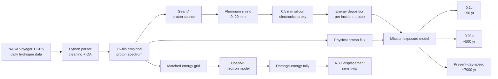
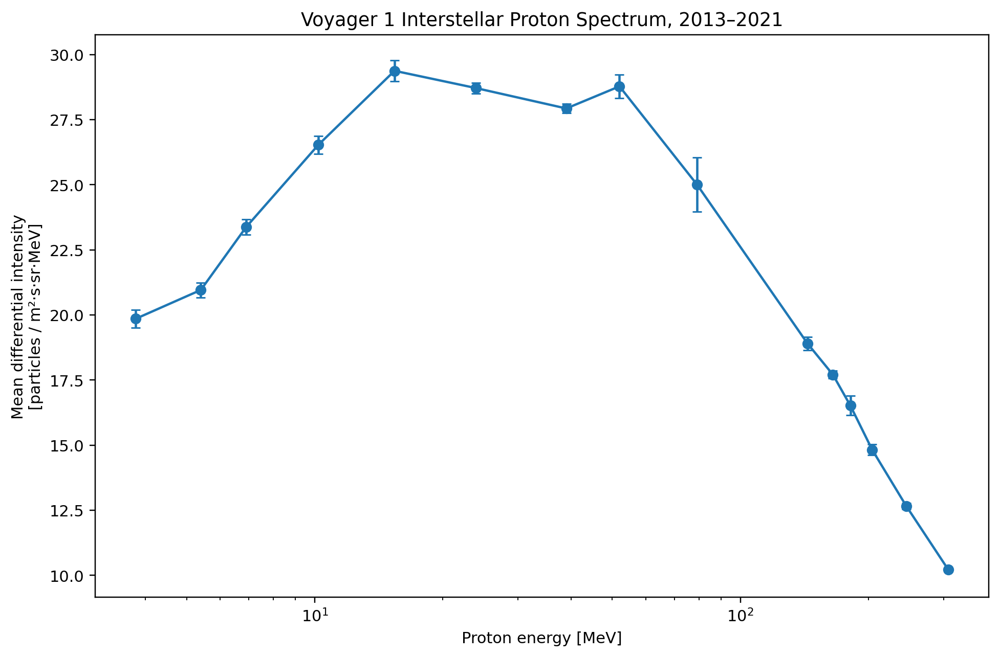
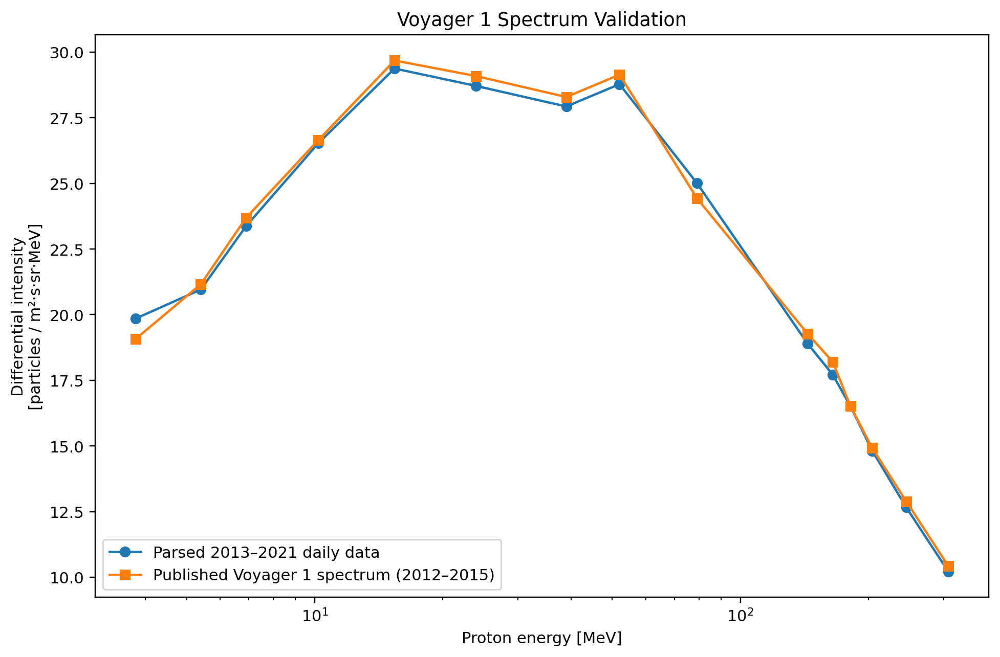
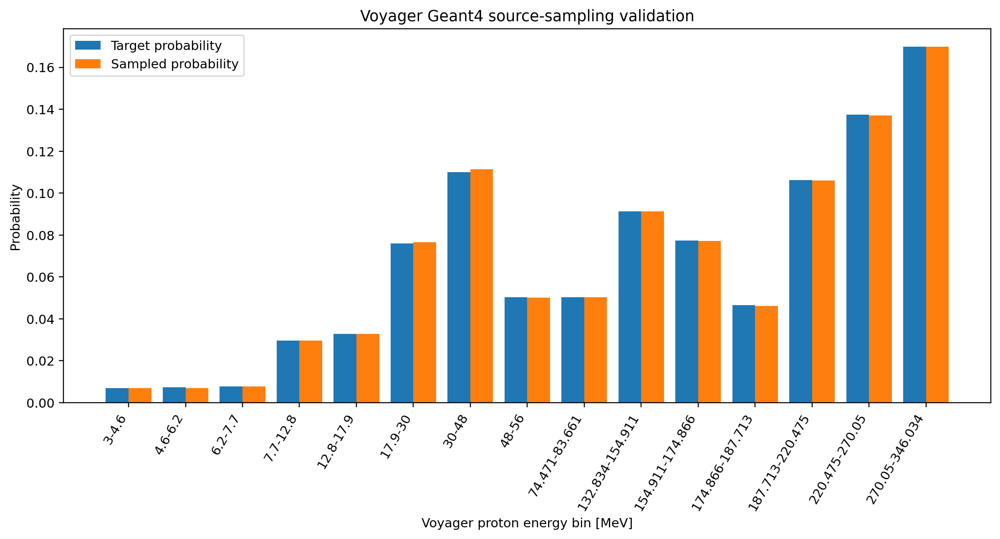
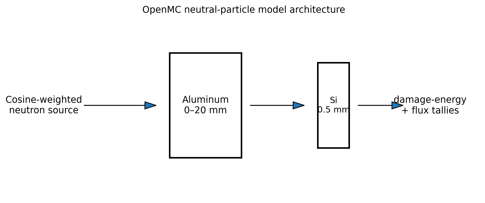

# Interstellar Radiation Modeling

**Voyager 1 data analysis · Monte Carlo particle transport · spacecraft shielding · silicon radiation damage**

This project develops a computational framework for studying long-duration spacecraft-electronics exposure during a hypothetical mission to **Proxima Centauri b**. It combines an empirical interstellar proton spectrum derived from **NASA Voyager 1 Cosmic Ray Subsystem measurements** with two complementary particle-transport models:

- **Geant4** for charged-particle proton transport, aluminum shielding, and energy deposition in silicon.
- **OpenMC** for a matched-energy neutral-particle sensitivity study focused on neutron damage energy and exploratory NRT displacement damage.

The central research question is:

> **How does aluminum spacecraft shielding affect proton-induced energy deposition in silicon electronics under a Voyager-derived interstellar radiation spectrum, and how does accumulated exposure change for hypothetical missions to Proxima Centauri b at 0.1c, 0.01c, and present-day spacecraft speeds?**

A secondary question asks:

> **How does neutron-induced displacement damage in silicon vary across comparable particle energies and shielding thicknesses?**

---

## Project highlights

- Parsed **2,884 days** of Voyager 1 hydrogen-flux observations from **September 20, 2013 through September 30, 2021**.
- Converted the raw NASA-derived wide-format export into a reproducible, analysis-ready spectrum.
- Reduced **18 raw energy-channel/detector combinations** to **15 unique measured proton energy bins** spanning approximately **3–346 MeV**.
- Preserved flux uncertainty, particle counts, detector live time, geometry-factor metadata, energy bounds, and detector provenance.
- Constructed a normalized Monte Carlo proton source directly from the measured Voyager spectrum.
- Independently validated the source sampler with **500,000 Monte Carlo draws**.
- Implemented a Geant4 aluminum-shield / silicon-target transport model with cosine-weighted incidence from an isotropic field.
- Rebuilt the original OpenMC model around the same conceptual shielding geometry and a Voyager-aligned neutron energy grid.
- Implemented mission-duration scaling for approximately **50-, 500-, and 7,000-year** scenarios.
- Kept the research status explicit: source construction and model implementation are complete; full transport execution and convergence studies remain pending.

---

## System architecture



---

# Scientific background

## Motivation: radiation over interstellar timescales

The project grew out of an earlier research study on the radiation environment and electronics survivability of a hypothetical probe traveling to Proxima Centauri b.

The original notebook treated Proxima Centauri b as approximately **4.22 light-years** away and compared three simplified constant-speed travel cases:

| Mission-speed scenario | Approximate travel time used in the research |
|---|---:|
| 0.1c | ~50 years |
| 0.01c | ~500 years |
| Present-day spacecraft-speed baseline (~400,000 mph) | ~7,000 years |

These values are used as **exposure-duration scenarios**, not as complete trajectory solutions. They neglect acceleration/deceleration profiles, gravitational assists, relativistic transformation of the incident radiation field, and the local environment at the destination.

The important engineering idea is that radiation damage depends not only on instantaneous particle intensity but also on **integrated exposure**. A radiation environment that is tolerable for a short mission may become a substantially different reliability problem when exposure continues for decades, centuries, or millennia.

## Radiation environments identified in the original literature review

The research notebook separated the space-radiation problem into several environments:

- **Galactic cosmic rays (GCRs)** — energetic particles originating outside the solar system.
- **Solar radiation / solar energetic particle events (SEPs)** — temporally variable particle populations associated with solar activity.
- **Planetary radiation belts** — charged particles trapped by magnetospheres.
- **Propulsion-associated radiation** — especially neutron fields associated with hypothetical nuclear or fusion propulsion systems.

The notebook's background literature characterized GCRs as being dominated by ionized hydrogen/protons, with alpha particles, electrons, and heavier nuclei contributing smaller fractions. This motivated proton transport as the first measured interstellar component to model computationally.

The present repository intentionally narrows the much broader original research question. **Voyager-measured interstellar protons** form the empirical charged-particle source, while OpenMC is reserved for a separate neutral-particle sensitivity calculation.

## Flux and fluence

A central distinction in the original research was the difference between **flux/intensity** and **fluence**.

Flux or intensity describes a rate of particle passage. Fluence is the time-integrated particle exposure:

$$
\Phi = \int F(t)\,dt.
$$

If the environment is approximated as stationary over an interval $T$,

$$
\Phi \approx FT.
$$

This relationship is what connects the Voyager observations to the mission-duration scenarios.

## Radiation effects on electronics

The original literature review organized electronics effects into three broad categories.

### Total Ionizing Dose (TID)

TID concerns cumulative ionization produced by deposited radiation energy. Long-term ionizing exposure can alter electronic materials and device behavior.

In this project, Geant4's **total energy deposited in silicon** is the fundamental transport score relevant to an absorbed-dose calculation.

### Displacement Damage Dose (DDD)

Energetic particles can transfer sufficient energy to atoms in a crystalline material to displace them from lattice sites, creating defects that may degrade semiconductor properties.

The OpenMC branch therefore focuses on **damage energy** in silicon and an exploratory NRT displacement calculation.

### Single Event Effects (SEE)

A single energetic particle can produce a sufficiently concentrated disturbance to affect an electronic device, ranging from transient state changes to destructive events.

This repository does **not** currently simulate transistor-level SEE probabilities. SEE remains part of the scientific motivation and background rather than a claimed output.

---

# NASA Voyager 1 data

## Why Voyager 1?

The original research considered several observational sources:

- **CRaTER** aboard the Lunar Reconnaissance Orbiter for the local lunar GCR/SEP environment.
- **Pioneer 10/11** for historical exposure in high-radiation planetary environments.
- **Voyager 1 and Voyager 2** for particle fluxes and spectra after reaching interstellar space.

Voyager is especially useful for this project because the goal is not to characterize near-Earth radiation, but to obtain an empirical basis for the particle environment **outside the heliosphere**.

The final model uses **Voyager 1 one-day-average hydrogen measurements from 2013–2021**, focusing on the post-heliopause period.

## Raw dataset

The NASA-derived text export contains:

- **2,884 daily timestamps**
- **18 energy-channel / detector combinations**
- differential hydrogen flux
- reported statistical error
- particle count
- detector live time
- geometry factor (`GF`)

The supplied flux units are:

```text
particles / m²-s-sr-MeV/nuc
```

For hydrogen, one nucleus contains one nucleon, so the energy coordinate is numerically:

```text
MeV/nuc = MeV/proton
```

The raw file includes energy channels from approximately **3 to 346 MeV/nucleon** and measurements associated with detector/channel identifiers including:

```text
LC3
LD3
IIA3
IIPY
IIPH
```

The original export is preserved unchanged:

```text
data/raw/voyager1_hydrogen_flux_2013_2021.txt
```

## Why parsing was necessary

The source file is a wide-format daily table. For every energy channel, each date contains a repeated block:

```text
Flux | Error | Count | LiveTime | GF
```

That format is useful as an instrument export but inconvenient for statistical analysis or Monte Carlo source generation.

The parser converts it into a structured representation in which energy bounds, detector identity, observation date, flux, uncertainty, count, live time, and geometry factor remain explicitly associated.

## Cleaning decisions

The processing pipeline is deliberately conservative:

1. Records with no valid counts / sentinel uncertainty values are treated as **missing measurements**, not physical zero flux.
2. A geometry-factor value of `-1` is treated as unavailable metadata rather than a physical value.
3. The raw source file is never overwritten.
4. Detector identity is preserved.
5. No interpolation is introduced across unmeasured energy intervals.
6. Source construction is reproducible from the raw file with the included Python script.

### Duplicate low-energy channels

Three low-energy intervals occur twice, once from `LD3` and once from `LC3`:

```text
3.0–4.6 MeV
4.6–6.2 MeV
6.2–7.7 MeV
```

The primary finalized spectrum retains the `LC3` measurements and excludes the duplicate `LD3` channels rather than combining two detector streams without a documented statistical rule.

This reduces **18 raw detector/channel combinations** to **15 unique measured energy bins**.

## Representative spectrum

For each retained energy bin, the project uses the **arithmetic mean of valid daily differential intensities** over 2013–2021 as the baseline source intensity.

The mean is used rather than the median because the eventual mission model is based on time-integrated exposure: real periods of elevated particle intensity contribute to cumulative fluence and should not automatically be discarded as outliers.

The processed table also retains variability and quality statistics, including daily spread and reported measurement uncertainty.

### Final Voyager 1 proton channels

| Measured energy bin [MeV] | Representative energy [MeV] | Detector | Mean differential intensity | Geant4 source weight |
|---:|---:|:---:|---:|---:|
| 3–4.6 | 3.8 | LC3 | 19.85 | 0.70% |
| 4.6–6.2 | 5.4 | LC3 | 20.96 | 0.73% |
| 6.2–7.7 | 6.9 | LC3 | 23.37 | 0.77% |
| 7.7–12.8 | 10.2 | IIA3 | 26.53 | 2.96% |
| 12.8–17.9 | 15.4 | IIA3 | 29.37 | 3.28% |
| 17.9–30 | 23.9 | IIA3 | 28.71 | 7.61% |
| 30–48 | 39 | IIA3 | 27.93 | 11.01% |
| 48–56 | 52 | IIA3 | 28.78 | 5.04% |
| 74.471–83.661 | 79.1 | IIPY | 25.00 | 5.03% |
| 132.834–154.911 | 143.9 | IIPH | 18.90 | 9.13% |
| 154.911–174.866 | 164.9 | IIPH | 17.71 | 7.74% |
| 174.866–187.713 | 181.3 | IIPH | 16.52 | 4.65% |
| 187.713–220.475 | 204.1 | IIPH | 14.82 | 10.63% |
| 220.475–270.05 | 245.3 | IIPH | 12.66 | 13.74% |
| 270.05–346.034 | 308 | IIPH | 10.22 | 16.99% |

Mean differential intensity is in:

```text
particles / m²-s-sr-MeV
```

for the hydrogen/proton data.

The complete processed table is stored in:

```text
data/processed/voyager1_proton_spectrum_final.csv
```



## Spectrum validation

Because the raw export is structurally complicated, the reconstructed spectrum was independently compared with a published Voyager 1 proton spectrum over an overlapping time interval.

The finalized reconstruction showed approximately:

- **1.54% mean absolute channel-by-channel difference**
- **4.06% maximum absolute difference**

That agreement provides a useful independent quality check on:

- parsing order,
- units,
- energy-bin interpretation,
- detector selection,
- and missing-value handling.



---

# Mathematical formulation of the empirical source

## 1. Differential intensity

The Voyager observations provide an energy-differential directional particle intensity:

$$
j(E,t).
$$

Its units are:

$$
[j]
=
\frac{\text{particles}}
{\text{m}^2\,\text{s}\,\text{sr}\,\text{MeV}}.
$$

For measured energy channel $i$,

$$
E_i^- \le E \le E_i^+,
$$

with bin width

$$
\Delta E_i = E_i^+ - E_i^-.
$$

The baseline intensity for that channel is the mean over valid daily measurements:

$$
\bar j_i
=
\frac{1}{N_i}
\sum_{k=1}^{N_i}j_i(t_k).
$$

## 2. Integrating each measured energy bin

For the first empirical source model, $j(E)$ is assumed piecewise constant inside each measured channel.

Thus the directional intensity represented by bin $i$ is approximated as:

$$
I_i
\approx
\bar j_i \Delta E_i.
$$

The energy coordinate has been integrated out, so:

$$
[I_i]
=
\frac{\text{particles}}
{\text{m}^2\,\text{s}\,\text{sr}}.
$$

This approximation is transparent and data-driven: it uses what was actually measured and does not invent a spectral curve in the unmeasured gaps.

## 3. Monte Carlo energy-bin probabilities

To turn the measured spectrum into a source distribution, each bin is weighted by its energy-integrated intensity:

$$
W_i = \bar j_i\Delta E_i.
$$

The probability of sampling bin $i$ is then:

$$
\boxed{
P_i
=
\frac{\bar j_i\Delta E_i}
{\sum_j \bar j_j\Delta E_j}
}.
$$

After selecting a bin, the first implementation samples an energy uniformly within that interval:

$$
E
=
E_i^- + U(E_i^+ - E_i^-),
\qquad
U\sim\mathrm{Uniform}(0,1).
$$

Therefore, the source is not reduced to 15 monoenergetic lines. It is a **piecewise-constant empirical spectrum over the measured Voyager intervals**.

## 4. Isotropic intensity incident on a plane

The original research treated the deep-space GCR environment as approximately isotropic.

For isotropic directional intensity $j(E)$, particle flux crossing a plane from one hemisphere is:

$$
F(E)
=
\int_{\Omega_+}
j(E)\cos\theta\,d\Omega.
$$

Using

$$
d\Omega
=
\sin\theta\,d\theta\,d\phi,
$$

we obtain

$$
F(E)
=
j(E)
\int_0^{2\pi}
\int_0^{\pi/2}
\cos\theta\sin\theta
\,d\theta\,d\phi.
$$

The angular integral is $\pi$, giving

$$
\boxed{
F(E)=\pi j(E)
}.
$$

Across the measured bins,

$$
F_{\text{measured}}
\approx
\pi
\sum_i
\bar j_i\Delta E_i.
$$

For the finalized spectrum,

$$
\sum_i \bar j_i\Delta E_i
\approx
4567.8
\frac{\text{particles}}
{\text{m}^2\,\text{s}\,\text{sr}},
$$

which gives, under the planar isotropic assumption,

$$
\boxed{
F_{\text{measured}}
\approx
1.435\times10^4
\frac{\text{protons}}
{\text{m}^2\,\text{s}}
}.
$$

This quantity applies only to the **measured energy bands represented by the selected Voyager channels**.

## 5. Sampling the incidence angle

A common mistake would be to sample $\theta$ uniformly.

For an isotropic field, the distribution of particles that actually **cross a plane** is cosine weighted.

Let

$$
\mu=\cos\theta.
$$

The normalized distribution is

$$
p(\mu)=2\mu,
\qquad
0\le\mu\le1.
$$

Its cumulative distribution is

$$
C(\mu)=\mu^2.
$$

Inverse-transform sampling therefore gives

$$
\boxed{
\mu=\sqrt{U}
},
\qquad
U\sim\mathrm{Uniform}(0,1).
$$

Both model branches use this plane-crossing logic.

The Geant4 source generator was independently validated with **500,000 draws**:

$$
\langle\cos\theta\rangle_{\text{sampled}}
=
0.666570.
$$

For $p(\mu)=2\mu$, the theoretical mean is

$$
E[\mu]
=
\int_0^1\mu(2\mu)\,d\mu
=
\frac{2}{3}
=
0.666667.
$$

The maximum absolute error between requested and sampled energy-bin probability was approximately **0.00124**.

---

# Mission exposure mathematics

## Travel time

For the intentionally simplified constant-speed model,

$$
T=\frac{d}{v}.
$$

With the original research distance of approximately $4.22$ light-years, the project evaluates the three approximate exposure durations listed earlier.

## Fluence

If the planar proton flux is $F$, cumulative proton fluence after duration $T$ is

$$
\boxed{
\Phi = FT
}.
$$

Fluence has units:

$$
[\Phi]
=
\frac{\text{particles}}{\text{m}^2}.
$$

Under the stationary-environment assumption, exposure therefore scales linearly with mission duration.

Relative to a 50-year mission,

$$
\frac{\Phi_{500}}{\Phi_{50}}\approx10
$$

and

$$
\frac{\Phi_{7000}}{\Phi_{50}}\approx140.
$$

These ratios arise before any shielding response is considered.

---

# Geant4 charged-particle transport

## Geometry

The Geant4 model deliberately isolates one clear engineering variable: **aluminum shielding thickness**.

```text
Voyager-derived proton field
             ↓
       aluminum shield
  0 / 1 / 2 / 5 / 10 / 20 mm
             ↓
       silicon target
          0.5 mm
```

The silicon slab is an **electronics material proxy**, not a transistor-level model.

## Event pipeline

For each primary proton:

1. choose a measured Voyager energy bin using $P_i$,
2. sample proton energy inside the chosen measured interval,
3. generate a cosine-weighted incident direction,
4. transport the proton through aluminum,
5. transport produced secondary particles,
6. sum total energy deposited in the silicon target.

The event output records:

```text
event ID
source-bin index
primary energy
cos(theta)
shield thickness
silicon thickness
total silicon energy deposition
```

## Energy deposition and absorbed dose

Let Geant4 return mean energy deposited in silicon per incident proton:

$$
\langle E_{\text{dep}}\rangle.
$$

For mission fluence $\Phi$,

$$
\frac{E}{A}
=
\langle E_{\text{dep}}\rangle\Phi.
$$

The areal mass of a silicon slab of density $\rho_{\text{Si}}$ and thickness $t_{\text{Si}}$ is

$$
\frac{m}{A}
=
\rho_{\text{Si}}t_{\text{Si}}.
$$

Since absorbed dose is

$$
D=\frac{E}{m},
$$

the slab dose becomes

$$
\boxed{
D
=
\frac{
\langle E_{\text{dep}}\rangle\Phi
}{
\rho_{\text{Si}}t_{\text{Si}}
}
}.
$$

The implementation converts MeV to joules so that dose can be reported in gray:

$$
1\ \mathrm{Gy}=1\ \mathrm{J/kg}.
$$



---

# OpenMC neutral-particle sensitivity study

The OpenMC branch is intentionally complementary to Geant4.

> **Voyager measured energetic hydrogen/protons, not a neutron spectrum.**

The neutral model therefore does not reinterpret the Voyager measurements as neutrons. Instead, it asks a controlled sensitivity question:

> How does neutron-induced displacement response in silicon vary when the neutron energy scale is aligned with representative energies from the measured proton spectrum?

## Why the original OpenMC model was rebuilt

The original research model was exploratory. It used:

- a 100 cm silicon sphere,
- an internal point neutron source,
- manually selected particle energies,
- a damage-energy tally,
- and a subsequent NRT/DPA calculation.

Reviewing the surviving notebook also revealed a material inconsistency in the downstream calculation: silicon density was combined with iron atomic-mass variables, and iron ARC-DPA constants were later applied to the silicon calculation.

Rather than preserve those numerical outputs, the repository rebuilds the model around a more coherent design.

## Rebuilt OpenMC geometry

```text
cosine-weighted external neutron field
                ↓
         aluminum shielding
            0–20 mm
                ↓
          silicon target
             0.5 mm
                ↓
       damage-energy + flux
```

The geometry now parallels the Geant4 shielding problem.

The primary experiment uses representative neutron energies aligned with the Voyager proton-channel energy grid. An optional Voyager-weighted neutral source is included only as a **hypothetical sensitivity case**.

## Damage energy

The main material-damage score is silicon damage energy,

$$
T_d,
$$

reported per source neutron.

Damage energy represents the portion of transferred energy available for atomic-displacement production.

## NRT displacement model

The original research used the NRT/Kinchin-Pease form

$$
\boxed{
N_d
=
\frac{0.8T_d}{2E_d}
},
$$

where

- $N_d$ is the estimated number of atomic displacements,
- $T_d$ is damage energy,
- $E_d$ is the displacement-threshold parameter.

The original silicon study used

$$
E_d=20.5\ \mathrm{eV}.
$$

This parameter is retained explicitly as a modeling assumption.

## From displacement count to DPA

For silicon density $\rho_{\text{Si}}$, molar mass $M_{\text{Si}}$, and Avogadro constant $N_A$, the atomic number density is

$$
n_{\text{Si}}
=
\frac{\rho_{\text{Si}}}{M_{\text{Si}}}N_A.
$$

For target thickness $t_{\text{Si}}$, atom areal density is

$$
N_{\text{A,Si}}
=
n_{\text{Si}}t_{\text{Si}}.
$$

For neutron fluence $\Phi_n$,

$$
\boxed{
\mathrm{DPA}
=
\frac{N_d\Phi_n}
{n_{\text{Si}}t_{\text{Si}}}
}.
$$

The analysis pipeline reports the normalized response as:

```text
NRT-DPA per 1e15 incident neutrons/cm²
```

rather than claiming a spacecraft-specific failure threshold.



---

# How the Geant4 and OpenMC models relate

| Component | Geant4 | OpenMC |
|---|---|---|
| Particle | Proton | Neutron |
| Source basis | Measured Voyager spectrum | Voyager-aligned energy grid |
| Interpretation | Interstellar charged-particle transport | Neutral-particle sensitivity study |
| Shield | Aluminum | Aluminum |
| Target | Silicon | Silicon |
| Main score | Energy deposition | Damage energy + flux |
| Derived metric | Absorbed dose | NRT displacement / DPA |
| Voyager protons treated as neutrons? | No | No |

The purpose is **not** to compare proton dose and neutron DPA as though they were the same quantity.

The common geometry and energy scale instead create a controlled framework for asking how **particle type, energy, and shielding** influence different radiation-response metrics.

---

# Repository structure

```text
interstellar-radiation-modeling/
|
|-- README.md
|-- requirements.txt
|
|-- analysis/
|   `-- build_voyager_spectrum.py
|
|-- data/
|   |-- README.md
|   |-- raw/
|   |   `-- voyager1_hydrogen_flux_2013_2021.txt
|   `-- processed/
|       |-- voyager1_proton_spectrum_final.csv
|       `-- geant4_voyager_proton_source_bins.csv
|
|-- geant4/
|   |-- CMakeLists.txt
|   |-- main.cc
|   |-- include/
|   |-- src/
|   `-- scripts/
|
|-- openmc/
|   |-- README.md
|   |-- model.py
|   |-- run_sweep.py
|   |-- analyze_results.py
|   |-- check_cross_sections.py
|   `-- data/
|
|-- docs/
|   |-- METHODS.md
|   |-- PROJECT_STATUS.md
|   `-- LIMITATIONS.md
|
`-- results/
    |-- voyager/
    `-- geant4/
```

---

# Reproducibility

## Python

```bash
pip install -r requirements.txt
python analysis/build_voyager_spectrum.py
```

## Geant4

After installing and configuring Geant4:

```bash
cd geant4
mkdir build
cd build
cmake ..
cmake --build . -j
```

## OpenMC

Export model inputs without executing transport:

```bash
cd openmc
python run_sweep.py --export-only
```

Before high-energy neutron runs, inspect the installed neutron cross-section configuration:

```bash
python check_cross_sections.py
```

The final OpenMC energy grid should be restricted to energies supported by the installed aluminum and silicon nuclear-data libraries rather than extrapolating unsupported cross sections.

---

# Current status

### Completed

- original literature review and research framing
- NASA Voyager 1 data acquisition
- raw-data parsing and cleaning
- 15-bin empirical proton-spectrum construction
- spectrum quality assurance / external validation
- Geant4 source-weight construction
- 500,000-draw source-sampling validation
- Geant4 geometry and proton-source implementation
- silicon energy-deposition scoring
- automated shielding-sweep pipeline
- mission-fluence / dose post-processing framework
- rebuilt OpenMC aluminum/silicon geometry
- matched-energy neutron source
- silicon damage-energy and flux tallies
- corrected silicon-only NRT / DPA normalization

### Pending execution / validation

- Geant4 compilation in a Geant4-enabled environment
- full proton transport runs
- Monte Carlo convergence study
- production-cut sensitivity study
- final shield-thickness dose results
- OpenMC cross-section energy-range verification
- OpenMC transport runs
- final neutron damage-response figures

> **No unexecuted Geant4 or OpenMC transport output is presented as a validated scientific result.**

---

# Assumptions and limitations

This is a scoped computational engineering model rather than a complete interstellar mission-radiation analysis.

1. The empirical source currently models **Voyager-measured protons only**.
2. Alpha particles, heavier GCR nuclei, and electrons are not yet transported.
3. Solar energetic particle events are outside the current interstellar baseline.
4. Missing Voyager energy intervals are not filled with invented interpolation.
5. The 2013–2021 spectrum is treated as representative when extrapolating to much longer hypothetical missions.
6. Spacecraft structure is simplified to planar aluminum shielding.
7. Silicon is a material proxy for electronics, not a complete transistor or circuit.
8. TID, displacement damage, and SEE are distinct mechanisms and are not collapsed into a single failure metric.
9. Travel scenarios assume simplified constant speeds.
10. Acceleration, deceleration, mission trajectory, and gravitational assists are not modeled.
11. Relativistic transformation of the external particle distribution is outside the current implementation.
12. The radiation environment near Proxima Centauri b itself is outside the Voyager-derived baseline.
13. High-energy OpenMC cases depend on the energy range of the installed evaluated neutron-data library.

---

# Research lineage

This repository grew from an earlier independent research study on **radiation exposure and electronics survivability during a hypothetical mission to Proxima Centauri b**.

The original work explored:

- interstellar propulsion concepts,
- GCR, solar, and planetary radiation environments,
- Voyager, Pioneer, and CRaTER data sources,
- radiation effects on spacecraft electronics,
- simplified OpenMC displacement-damage calculations,
- and mission-duration comparisons.

The current repository narrows and strengthens that work by:

- replacing loosely chosen particle-energy assumptions with a reproducible NASA-derived spectrum,
- separating measured charged-particle physics from hypothetical neutral-particle analysis,
- aligning both transport models around a common aluminum-shield / silicon-target geometry,
- correcting the original silicon/iron inconsistency in the DPA calculation,
- and documenting assumptions rather than presenting preliminary calculations as validated results.

---

# Selected background sources from the original research

The original notebook drew on sources including:

- **NASA Voyager Cosmic Ray Subsystem data** — interstellar particle fluxes and spectra.
- **CRaTER / Lunar Reconnaissance Orbiter** — GCR and SEP measurements in the lunar radiation environment.
- **Pioneer 10 and 11 radiation studies** — historical radiation exposure near the giant planets.
- **Dever, Banks, de Groh & Miller (2012), _Degradation of Spacecraft Materials_** — spacecraft radiation/material degradation background.
- **Ramaswamy & Giovinazzi (2024), _The Journey to Proxima Centauri b_** — interstellar mission/travel-time context.
- **Griffin (2016), silicon displacement-damage metrics** — silicon displacement-threshold background.
- **OpenMC / Computational Reactor Physics Group** — Monte Carlo neutral-particle transport.
- **Fusion Energy Neutronics Workshop** — starting point for the original OpenMC DPA workflow.

---

# Data provenance

The raw Voyager data used in this project was obtained from NASA GSFC Voyager / Cosmic Ray Subsystem data products and is preserved in the repository without modification.

Processed data, source probabilities, plots, and model inputs are generated reproducibly from the raw export using the included scripts.
